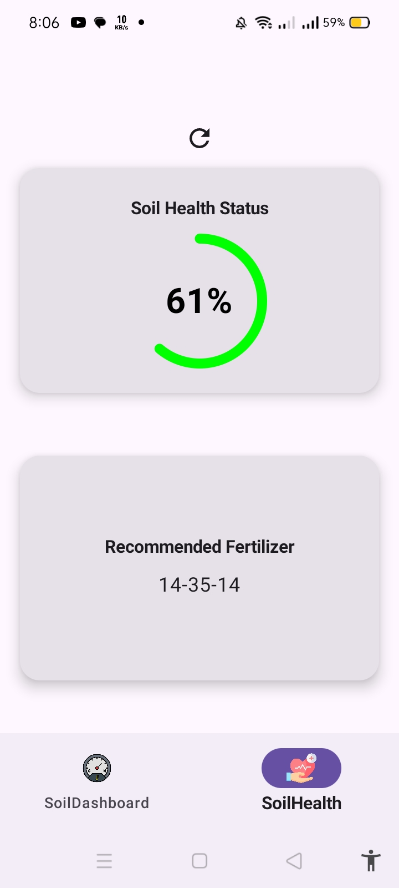

# **Soil Monitoring App**

A smart and intuitive native Android application built with **Kotlin** and **Jetpack Compose** for real-time monitoring of soil conditions. The app connects to **ThingSpeak API** and an **AI backend** to analyze soil parameters such as temperature, moisture, and nutrient levels, helping users make data-driven agricultural decisions.

## **Features**

- **Real-Time Data Fetching**: Retrieves live soil sensor readings (moisture, temperature, pH, etc.) from **ThingSpeak API**.
- **AI Analysis**: Integrates with an AI backend for soil classification, fertility prediction, and irrigation recommendations.
- **Data Visualization**: Displays interactive charts and insights using modern Compose UI component
- **Clean Architecture**: Follows MVI structure with repository pattern for scalable and maintainable code.
- **Dependency Injection**: Implemented using **Hilt** for modular dependency management.
- **Network Requests**: Uses **Retrofit** and **OkHttp** for smooth and efficient API communication.
- **Compose Navigation**: Handles in-app screen transitions and data passing between UI components.

## **Installation Guide**

### **Prerequisites**

Before installing the app, ensure you have the following installed:

- **Android Studio** (version 7.0 or higher)
- **Kotlin** (latest stable version)
- **Android SDK** (latest stable version)
- A **ThingSpeak Channel** with API Key (for testing live data)

2. **Open the Project in Android Studio**  
- Launch Android Studio  
- Select **“Open an existing project”**  
- Navigate to the cloned folder and open it  

3. **Sync Project with Gradle Files**  
Android Studio should automatically prompt you to sync Gradle.  
If not, click **“Sync Now”** to install all required dependencies.

4. **Build the Project**  
Go to **Build > Rebuild Project** to ensure everything compiles successfully.

5. **Run the App**  
- Connect a physical Android device or start an emulator  
- Click the **Run (▶)** button to launch the app  

6. **Permissions**  
The app requires Internet permission to fetch data from APIs.  
Ensure the following is included in your `AndroidManifest.xml`:

<table>
  <tr>
    <td align="center">
      
       Screenshot 1
    </td>
    <td align="center">
      
       Screenshot 2
    </td>
     <td align="center">
      
       Screenshot 3
    </td>
    <td align="center">
      
       Screenshot 4
    </td>
     
